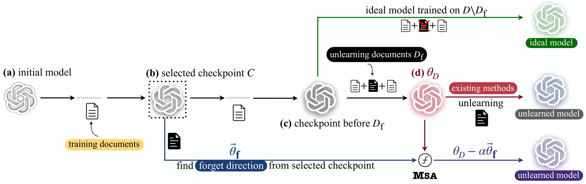

# Model State Arithmetic for Machine Unlearning

[](TODO)

<!-- Add your method’s cover image here -->



This repository contains the official implementation of **Model State Arithmetic (MSA)**, introduced in the paper:

> 📄 *“Model State Arithmetic for Machine Unlearning”*
> Large language models are trained on massive corpora of web data, which may include private data, copyrighted material, factually inaccurate data, or data that degrades model performance. Eliminating the influence of such problematic datapoints through complete retraining—by repeatedly pretraining the model on datasets that exclude these specific instances—is computationally prohibitive. For this reason, unlearning algorithms have emerged that aim to eliminate the influence of particular datapoints, while otherwise preserving the model—at a low computational cost. However, precisely estimating and undoing the influence of individual datapoints has proved to be challenging. In this work, we propose a new algorithm, MSA, for estimating and undoing the influence of datapoints—by leveraging model checkpoints, i.e., artifacts capturing model states at different stages of pretraining. Our experimental results demonstrate that MSA consistently outperforms existing machine unlearning algorithms across multiple benchmarks, models, and evaluation metrics, suggesting that MSA could be an effective approach towards more flexible large language models that are capable of data erasure.


## ⚙️ Setup

Create and activate a dedicated conda environment, then install dependencies:

```bash
conda create -n MSA python=3.11 -c conda-forge
conda activate MSA
python -m pip install --upgrade pip wheel setuptools
pip install -r requirements.txt
MAX_JOBS=64 python -m pip -v install flash-attn --no-build-isolation
```


If you get errors while installing flash-attn, try setting up cuda and gcc modules before its installation. Example:

```
module load gcc/11.2.0
module load cuda/12.4.1
export CUDA_HOME=/opt/common/cuda/cuda-12.4.1
export CUDA_PATH=$CUDA_HOME
export PATH=$CUDA_HOME/bin:$PATH
```

---

## 🚀 Quick Start

### 1. Fine-tuning

Use `finetune.sh` to train a clean model on either a forget or retain dataset (e.g., `TOFU_QA_forget01`, `TOFU_QA_retain99_ft`) to calculate task vectors for unlearning, or on a mixed dataset (e.g., `TOFU_QA_full`) to get a corrupted target model to perform unlearning on. 


### 2. Unlearning via TV-based MSA
Run `tv_unlearn.sh` to apply MSA with different α/β settings. The method requires clean, corrupted, forget, and retain models to create the unlearned model as $\theta_{unlearn}=\theta_{corrupted} - \alpha \times (\theta_{forget}-\theta_{clean}) + \beta \times (\theta_{retain} - \theta_{clean})$. The parameter $\beta$ can be set to $0$ to perform unlearning without a retain set.


### 🤝 Acknowledgements
The code in this repo is inspired by [Open-Unlearning](https://github.com/locuslab/open-unlearning). 

## 📖 Citation

If you find our work useful, please consider citing us via:

```bibtex

```
